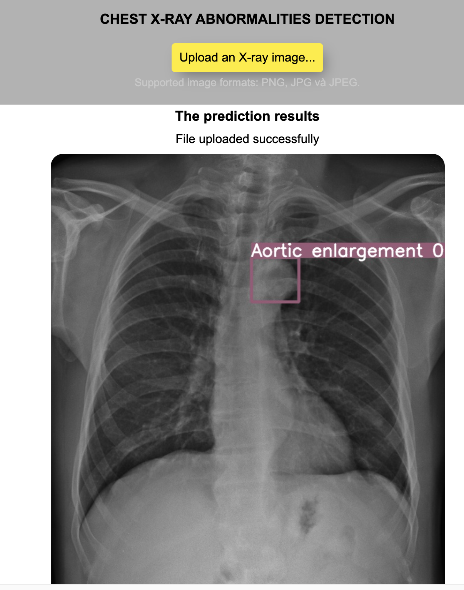

# Use YOLO v5 for Chest X-Ray Analysis
This project follows code from "MìAI"

Demo UI


1. Install anaconda
2. Create an environment python 3.8 and activate it.
3. In the environment run
   ```console
   pip install -r requirement.txt
   '''
4. Run flask
   ```console
   python svr_model.py
   '''
We use the dataset which is converted to jpg and labeled for yolo format on the website MiAI: https://www.mediafire.com/file/xwiio9bezjfc1l2/yolo_data.zip/file
Article link: https://www.miai.vn/2021/03/02/thu-lam-bac-si-chuan-doan-x-quang-cung-yolo-v5-phan-1-2/

#MìAI
Fanpage: http://facebook.com/miaiblog
Group trao đổi, chia sẻ: https://www.facebook.com/groups/miaigroup
Website: http://miai.vn
Youtube: http://bit.ly/miaiyoutube